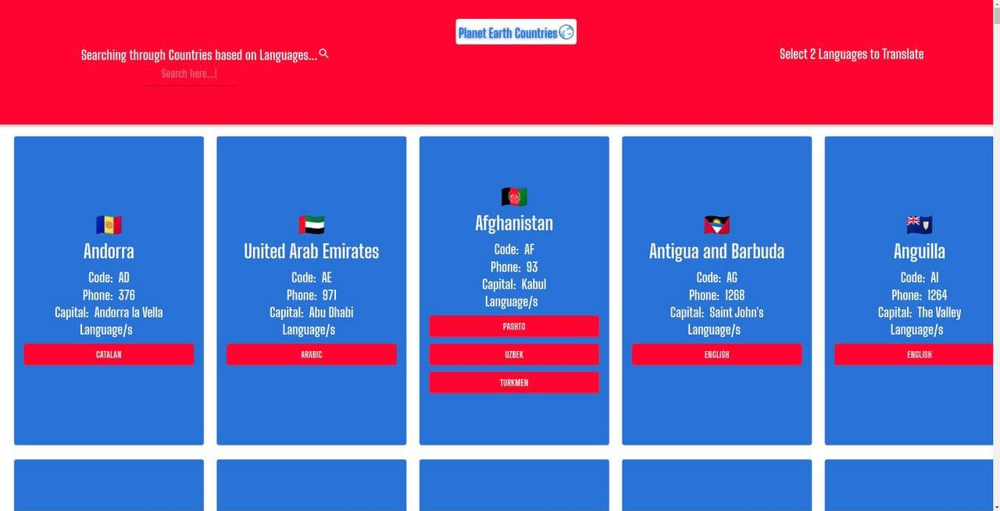
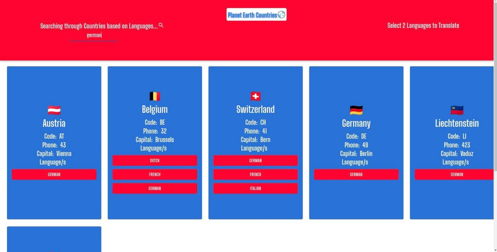
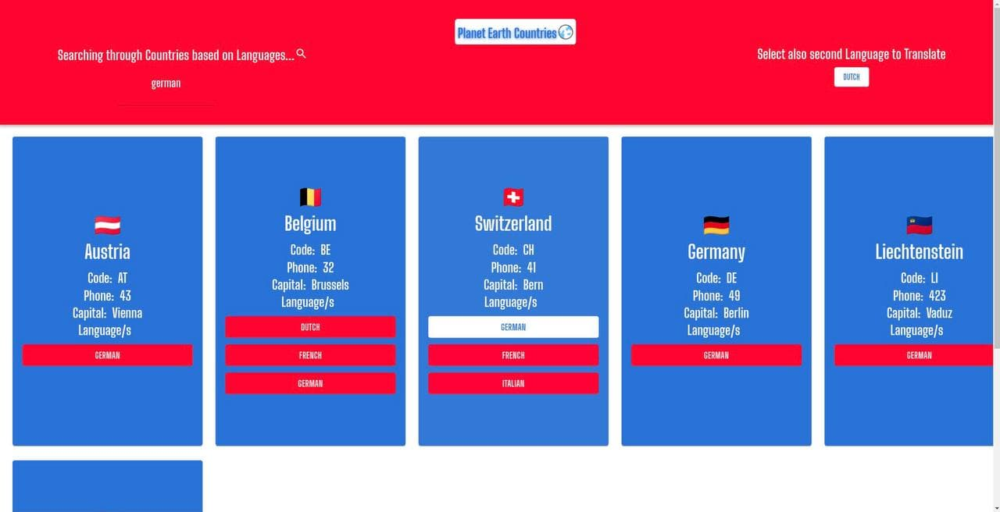
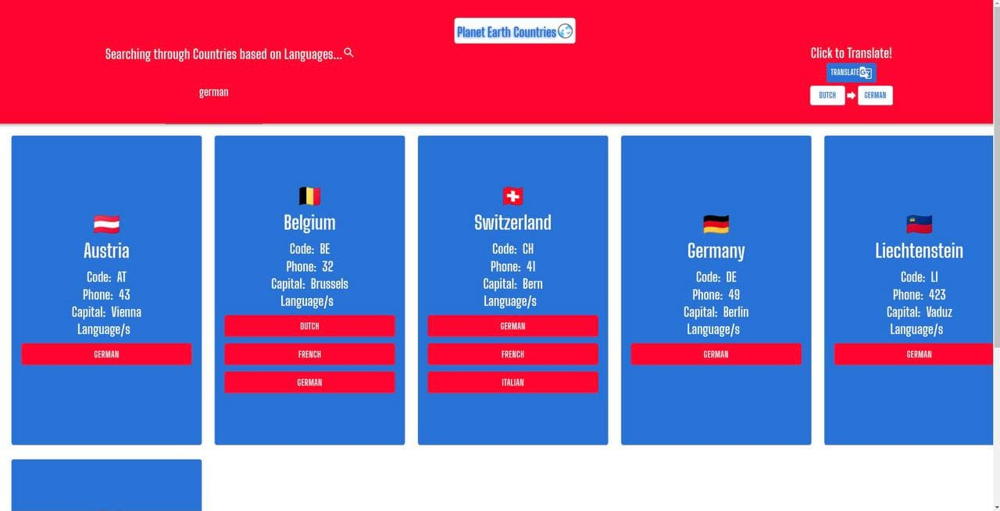
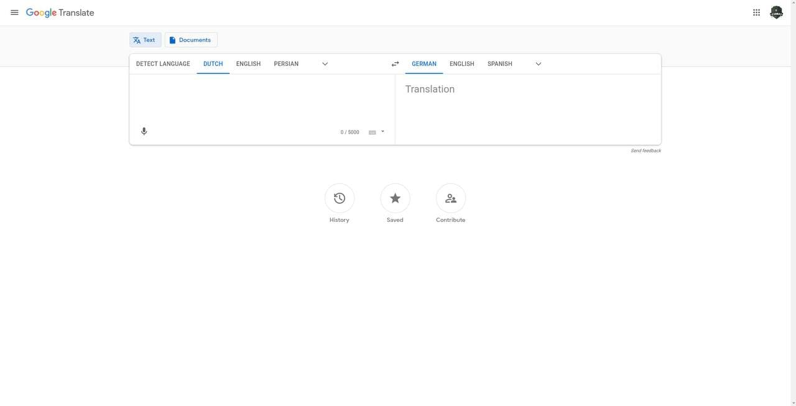

# react-graphql-materialui-planet-earth-countries-v2
 # https://ciamac-da.github.io/react-graphql-materialui-planet-earth-countries-v2/

 # About the APP📎 :
  It contains the list of countries that I recieve from GraphQL server & a search🔭 filter Input(you can search through countries base on a language name that you search for in input) & Google Translate functionality(you can klick on 2 languagues and then press Translate, and it will redirected to Google Translate URL und shows us 2 selected Languages on Google Translate)

